# **Relazione Progetto ML**

```
Marcucci Michele  [851905]
Mazzitelli Davide [851657]
```

# **Indice**
- [Introduzione](#introduzione)
  - [Obiettivo del progetto](#obiettivo-del-progetto)
  - [Dominio di riferimento](#dominio-di-riferimento)
- [Dataset](#dataset)
  - [Head dataset](#head-dataset)
- [Preprocessing](#preprocessing)
  - [Assunzioni ed analisi esplorativa](#assunzioni-ed-analisi-esplorativa)
  - [Memory](#memory-memoria-dello-storage-interno)
  - [Peso e ram](#weight-peso-del-laptop-e-ram)
  - [GPU](#gpu-informazioni-sulla-scheda-grafica)
  - [CPU](#cpu)
  - [Schermo](#schermo)
  - [Sistema operativo](#sistema-operativo)
  - [Risultato finale](#eliminazione-colonne-inutili-e-risultato-finale)
- [Modelli](#modelli-di-machine-learning-scelti)
  - [Albero di decisione](#albero-di-decisione)
  - [SVM](#svm)
  - [Random Forest](#random-forest)
- [Esperimenti](#esperimenti)
  - [Albero di decisione](#albero-di-decisione-1)
  - [SVM](#svm-1)
  - [Randome Forest](#random-forest-1)
- [Analisi finale e conclusione](#analisi-dei-risultati-ottenuti-e-conclusioni)
  - [Albero di decisione](#albero-di-decisione-2)
  - [SVM](#svm-2)
  - [Randome Forest](#random-forest-2)
  - [Analisi delle curve ROC e AUC](#analisi-delle-curve-roc-e-auc)

<div style="page-break-after: always"></div>

# **Introduzione**

## **Obiettivo del progetto:**

L'obiettivo del progetto consiste nell'identificare un dominio di interesse per il quale realizzare almeno 2 modelli di classificazione supervisionata e/o non supervisionata, individuando il relativo dataset.

## **Dominio di riferimento:**

Il dominio di interesse selezionato per il nostro progetto riguarda il prezzo di vendita di laptop nuovi sulla base dei rispettivi componenti e brand di produzione.


# **Dataset**

> link dataset: https://www.kaggle.com/datasets/muhammetvarl/laptop-price

Questo dataset raccoglie informazioni tecniche su diversi modelli e marche di laptop.
Esso consiste in 1303 elementi caratterizzati dai seguenti attributi:

1. **Company** - String - Laptop Manufacturer
2. **Product** - String - Brand and Model
3. **TypeName** - String - Type (Notebook, Ultrabook, Gaming, etc.)
4. **Inches** -Numeric - Screen Size
5. **ScreenResolution** - String - Screen Resolution
6. **Cpu** - String - Central Processing Unit (CPU)
7. **Ram** - String - Laptop RAM
8. **Memory** - String - Hard Disk / SSD Memory
9. **GPU** - String - Graphics Processing Units (GPU)
10. **OpSys** - String - Operating System
11. **Weight** - String - Laptop Weight
12. **Price_euros** - Numeric - Price (Euro)

## **Head dataset**

|ID|Company|Product|Type|Inches|ScreenRes|Cpu|Ram|Memory|Gpu|OpSys|Weight|Price|
|---------|-------|-------|--------|------|----------------|---|---|------|---|-----|------|-----------|
1|Apple|MacBook Pro|Ultrabook|13.3|IPS Panel Retina Display 2560x1600|Intel Core i5 2.3GHz|8GB|128GB SSD|Intel Iris Plus Graphics 640|macOS|1.37kg|1339.69|
14|Dell|Inspiron 3567|Notebook|15.6|Full HD 1920x1080|Intel Core i3 6006U 2GHz|4GB|256GB SSD|AMD Radeon R5 M430|Windows 10|2.2kg|498.90


<div style="page-break-after: always"></div>

# **Preprocessing**

## **Assunzioni ed analisi esplorativa**

Utilizzando l'attributo *Price_euros* deciso di generare 4 classi target divise per fasce di prezzo alla quale appartiene ogni laptop. A tal proposito abbiamo creato la colonna "ranges" costituita da quattro classi:

- **Fascia bassa**: < 500€
- **Fascia media**: 500-1000€
- **Fascia alta**: 1000-2000€
- **Fascia premium**: > 2000€


> Distribuzione delle istanze sulla base dell'attributo *ranges* nel dataset


## **Memory (memoria dello storage interno)**

Questa colonna contiene valori in diverse unità di misura (GB, TB) e riferiti a diversi dipi di hardware (SSD, HDD, ecc...), alcuni laptop hanno inoltre due Hard Drive, che possono essere anche di diverso tipo e dimensione (es: "128GB SSD + 1TB HDD").

Per ogni laptop abbiamo quindi deciso di estrapolare da questa colonna delle informazioni che seguissero una logica piu' precisa, ovvero:

| HDD | SSD | Altri tipi |
|-----|-----|------------|
|N. GB|N. GB|N. GB|

In questo modo abbiamo ottenuto informazioni relative al tipo di memora utilizzato e alla quantità di GB per tipo.
(gli SSD sono piu costosi degli HDD quindi è un dato utile ai fini della realizzazione del modello)

## **Weight (peso del laptop) e RAM**
Queste colonne contengono valori char che per semplicità sono stati trasformati in valori numerici.

(8GB -> 8 e 1.5kg -> 1.5)

NB: I dati relativi al peso dei pc interessano una fetta molto piccola del database, infatti spesso un pc molto pesante (4kg) è un pc da gaming o una workstation (Fascia alta-premium).

La ram invece risulta essere un chiaro fattore che fa aumentare il prezzo in base alla quantità presente:

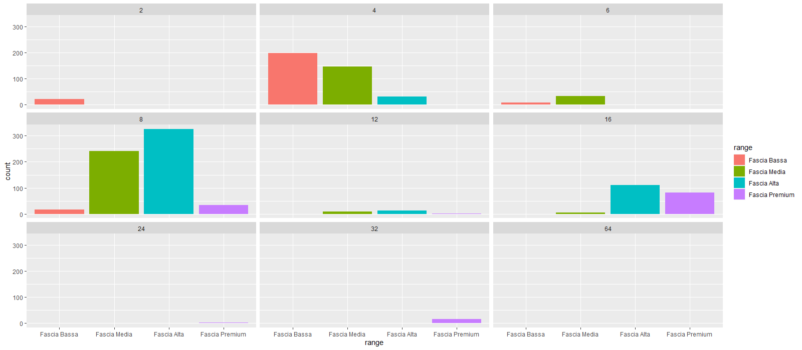

## **GPU (informazioni sulla scheda grafica)** 
Come per la colonna riguardante la memoria anche in questa sono presenti molte informazioni che necessitano una semplificazione.

Abbiamo inizialmente ragionato per quanto riguarda il produttore della scheda grafica: Intel e AMD sono schede grafiche quasi sempre integrate nei processori mentre NVIDIA realizza schede grafiche dedicate che fanno quindi alzare il prezzo.

La nostra idea era quindi:
- pc con scheda grafica Intel o AMD allora puo appartenere a qualunque fascia
- pc con scheda grafica NVIDIA allora appartiene quasi sicuramente alla fascia alta

Seguendo questa strada però non abbiamo tenuto conto che sia Intel, AMD che NVIDIA realizzano schede grafiche per diverse fasce di prezzo, abbiamo quindi cercato di estrapolare anche la "famiglia" di appartenza di ciascuna scheda grafica, ottenendo quindi piu diversificazione e piu classi (ma comunque un numero accettabile).

NB: Intel HD è la famiglia di schede grafiche integrata dai processori Intel, usata sia da pc low cost che da macbook e workstation.

> Distribuzione delle istanze nelle fasce di prezzo sulla base dell'attributo *RamGB*
 
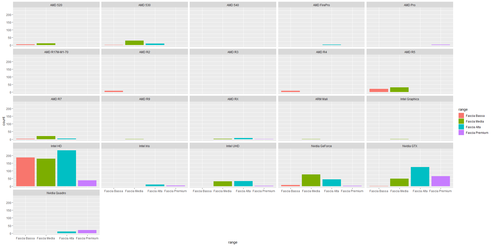


## **CPU**

Analogamente, come per la GPU, anche questa colonna contiene informazioni ridondanti. 
Abbiamo quindi cercato di mantenere solo il produttore della CPU insieme alla famiglia di appartenenza, inoltre abbiamo unificato tutte quelle famiglie di processori prodotte per la fascia bassa (come Intel Atom/Celeron/Pentium AMD-A/E), ottenedo questi dati:


## **Schermo**

Anche in questa colonna le informazioni contenute erano molto diverse le une dalle altre e utilizzavano anche diversi paramentri e tipologie di misura.

Es: 
- IPS Panel Retina Display 2560x1600
- Full HD 1920x1080
- 1366x768

Abbiamo innanzitutto cercato di estrapolare la tipologia di display (HD, FHD, QHD, 4K ecc) basandoci sia sulla risoluzione fornita sia sulla presenza o meno di una stringa che ne indicasse la tipologia, indicando anche, in una diversa colonna, se lo schermo fosse o meno TouchScreen.

> Distribuzione delle istanze nelle fasce di prezzo sulla base dell'attributo *ScreenResolution*


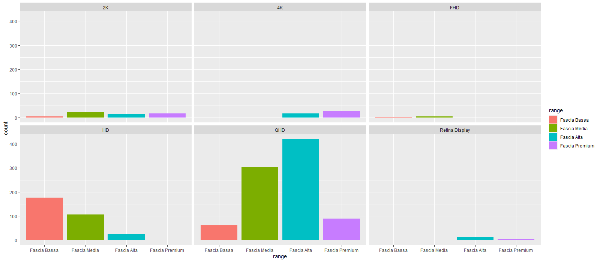

> Distribuzione delle istanze nelle fasce di prezzo sulla base dell'attributo *IsTouchScreen*


Abbiamo creato anche una colonna che raccogliesse l'informazione del tipo di pannello (IPS, True o False) dato che la presenza di un pannello IPS solitamente indica una maggiore qualità e costo complessivi:


## **Sistema Operativo**

Anche per questa colonna abbiamo provveduto ad una semplificazione delle classi presenti dividendo i sistemi operativi in "Windows", "Mac" e "Linux/Other" : 


## Eliminazione colonne inutili e risultato finale

Il nuovo dataset ottenuto e composto dalle seguenti colonne:
- Company
- TypeName
- Inches
- ScreenResolution
- OpSys
- Weight
- HDD
- SSD            
- range
- RamGB
- Gpu_Vendor
- Cpu_model      
- isTouchScreen
- isIPS
---


<div style="page-break-after: always"></div>

# **Modelli di Machine Learning scelti:**
Una volta elaborato il dataset si è proceduto con la scelta dei modelli di classificazione da implementare.


## **Albero di decisione:**
Il primo modello selezionato è l'albero di decisione a causa della possibilità di gestire sia dati numerici che categorici (generati nella fase di preprocessing dei dati) e la facilità di interpretazione.

Il dataset è stato quindi diviso in training set e test set (70% training set, 30% test set), ottenendo 919 record per il train set e 384 per il test set.

Il modello è stato addestrato utilizzando la funzione rpart, ponendo come target l'attributo *range* in funzione di tutti gli attributi del set.

L'albero di decisione risultante è il seguente:


Dall'immagine possiamo notare tra gli attributi quelli che permettono lo split ottimale del set.

Notiamo inoltre che l'albero minimo di decisione consistente utilizza 8 dei 12 attributi utilizzati per l'addestramento.

**Risultati ottenuti testando il modello con il test set:**
 

> 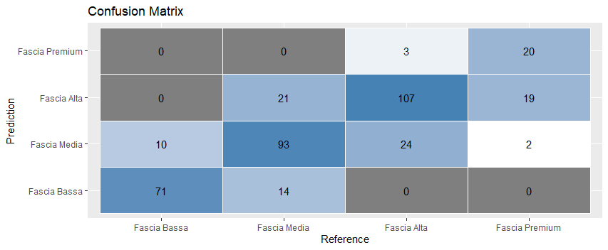
>
> **Accuratezza:** 76%
>
> **Precision:**
>
> - Fascia bassa: 84%
> - Fascia media: 72%
> - Fascia alta: 73%
> - Fascia premium: 87%
> 
>   **Precisione media:** 79% 
> 
> **Recall:**
>
> - Fascia bassa: 88%
> - Fascia media: 73%
> - Fascia alta: 80%
> - Fascia premium: 49%
>
>   **Recall media:** 73%
>
> **F-measure:**
> 
> - Fascia bassa: 86%
> - Fascia media: 72%
> - Fascia alta: 76%
> - Fascia premium: 62% 
>
>   **F-measure media:** 74%

---
## **SVM:**

Per le sue caratteristiche di efficienza nell'apprendimento, buone prestazioni e flessibilità, come secondo modello è stato selezionato l'SVM 

Il modello è stato addestrato utilizzando la funzione svm() della libreria e1071 utilizzando la stessa divisione del dataset introdotta precedentemente.

Di seguito sono raffigurati dei plot di dati del set utilizzando gli attributi con correlazione più alta con la variabile target (SSD, RamGB, Cpu_model):

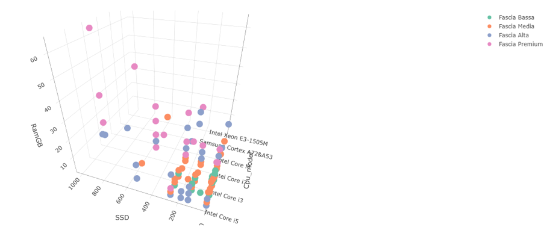 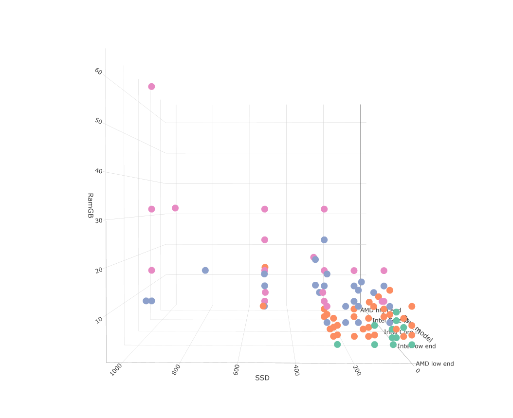 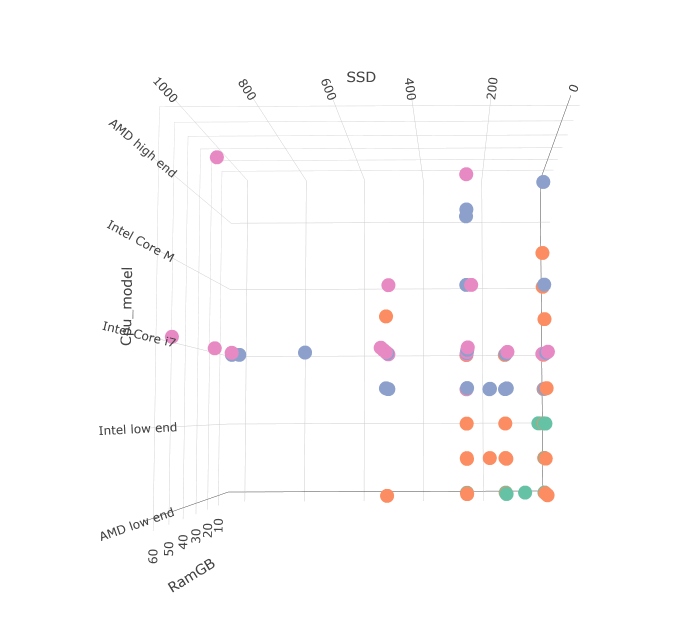

Analizzando la disposizione dei dati abbiamo notato che le istanze delle singole classi non sono separabili tramite linea retta a meno di introdurre errori nella classificazione, laptop appartenenti ad una fascia di prezzo possono infatti avere componenti comuni ad altri laptop appartenenti ad altre fasce; abbiamo quindi assunto che le istanze del set non siano linearmente separabili e utilizzato quindi un kernel non lineare per l'addestramento del modello utilizzando diverse configurazioni del parametro *cost* per ottenere risultati migliori.

Abbiamo quindi proceduto con l'addestramento del modello tramite kernel *radial* e settando il parametro *cost* prima ad 1 e poi a 100.

**Risultati ottenuti testando il modello con il test set:**

> **cost = 1**
>
> 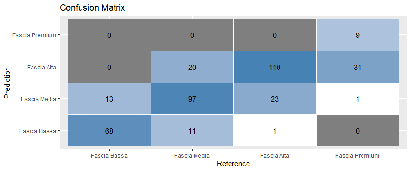
>
> Accuratezza: 74%
>
> **Precision:**
>
> - Fascia bassa: 85%
> - Fascia media: 72%
> - Fascia alta: 68%
> - Fascia premium: 100%
>
>   **Precisione media:** 81% 
>
> **Recall:**
>
> - Fascia bassa: 84%
> - Fascia media: 76%
> - Fascia alta: 82%
> - Fascia premium: 22%
>
>   **Recall media:** 66%
>
> **F-measure:**
> 
> - Fascia bassa: 84%
> - Fascia media: 74%
> - Fascia alta: 75%
> - Fascia premium: 36% 
>
>   **F-measure media:** 67%
> ---
> **cost = 100**
> 
> 
> 
> 
> Accuratezza: 78%
>  
> **Precision:**
>
> - Fascia bassa: 89%
> - Fascia media: 76%
> - Fascia alta: 74%
> - Fascia premium: 79%
>
>   **Precisione media:** 80% 
>
> **Recall:**
>
> - Fascia bassa: 91%
> - Fascia media: 81%
> - Fascia alta: 78%
> - Fascia premium: 46%
>
>   **Recall media:** 74%
>
> **F-measure:**
> 
> - Fascia bassa: 90%
> - Fascia media: 79%
> - Fascia alta: 76%
> - Fascia premium: 58% 
>
>   **F-measure media:** 76%

---
## **Random forest**

Oltre la scelta di utilizzare un modello basato su albero decisionale abbiamo ritenuto valido provare a generare un modello di tipo Random-forest, basato quindi sulla creazione di un insieme di alberi di decisione (foresta) per effettuare la classificazione.

In particolare, ciascun albero di decisione della foresta viene addestrato con un sottoinsieme casuale dei dati di addestramento, e la classificazione avverrà combinando le previsioni di molti alberi di decisione per migliorare la precisione del modello; ciascun albero nella foresta fornisce infatti una previsione, verrà poi utilizzata la maggioranza delle previsioni per determinare quella effettiva.

Il modello è stato quindi addestrato tramite la funzione *randomForest()* del pacchetto randomForest settando il parametro *ntree*, che determina la quantità di alberi di decisione generata (la grandezza della foresta), a 100.

**Risultati ottenuti testando il modello con il test set:**


> **ntree = 10**
> 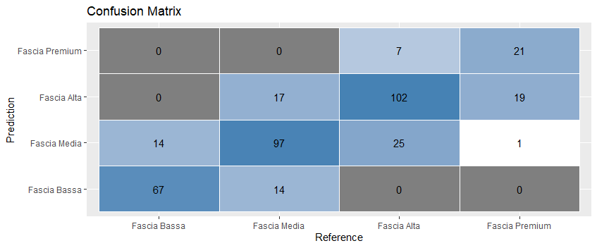
>
> Accuratezza: 75%
>
> **Precision:**
>
> - Fascia bassa: 85%
> - Fascia media: 71%
> - Fascia alta: 74%
> - Fascia premium: 75%
>
>   **Precisione media:** 76%
> 
> **Recall:**
>  
> - Fascia bassa: 83%
> - Fascia media: 77%
> - Fascia alta: 76%
> - Fascia premium: 51%
>
>   **Recall media:** 72%
>
> **F-measure:**
> 
> - Fascia bassa: 84%
> - Fascia media: 74%
> - Fascia alta: 75%
> - Fascia premium: 61%
>
>   **F-measure media:** 74% 
> 
> ---
> **ntree = 100**
> 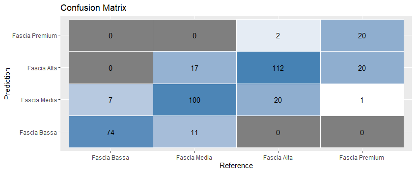
> 
> Accuratezza: 78%
>  
> **Precision:**
>
> - Fascia bassa: 87%
> - Fascia media: 76%
> - Fascia alta: 75%
> - Fascia premium: 86%
>
>   **Precisione media:** 81%
> 
> **Recall:**
>  
> - Fascia bassa: 88%
> - Fascia media: 80%
> - Fascia alta: 81%
> - Fascia premium: 46%
>
>   **Recall media:** 74%
>
> **F-measure:**
> 
> - Fascia bassa: 87%
> - Fascia media: 78%
> - Fascia alta: 78%
> - Fascia premium: 60%
>
>   **F-measure media:** 76%


# **Esperimenti:**

Calcolo di ROC e AUC dei modelli di classificazione:

---
## **Albero di decisione**:

**Curva ROC per classe**


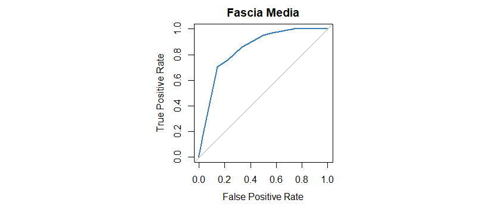

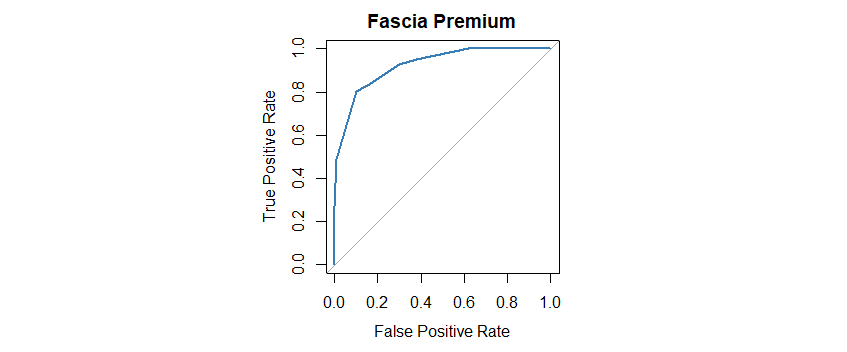

> AUC: 
> - Fascia bassa: 0.96 
> - Fascia media: 0.85 
> - Fascia alta: 0.85 
> - Fascia premim: 0.92
> 
> AUC media: 0.88 
> 


---

## **SVM**

**Curva ROC per classe**


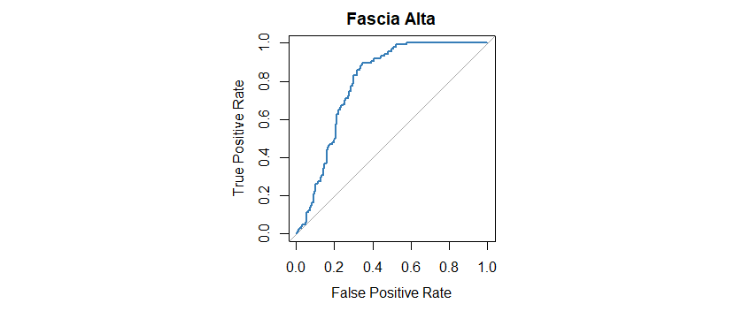


> AUC:
> - Fascia bassa: 0.95
> - Fascia media: 0.93
> - Fascia alta: 0.79
> - Fascia premium: 0.94
>
> AUC media: 0.90


---

## **Random forest**:

Curva ROC per classe:


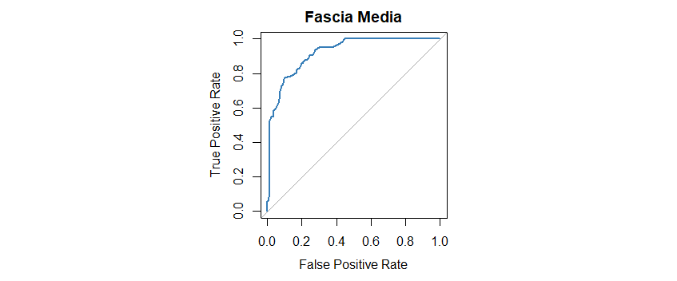

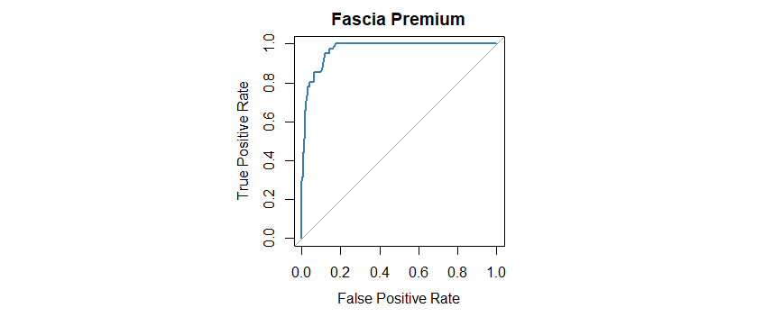

> AUC: 
> - Fascia bassa: 0.99
> - Fascia media: 0.90
> - Fascia alta: 0.92
> - Fascia premium: 0.96
>
> AUC media: 0.94


<div style="page-break-after: always"></div>

# **Analisi dei risultati ottenuti e conclusioni:**


## **Albero di decisione:**

Per quanto riguarda il modello di classificazione tramite albero di decisione, i risultati dei test effettuati sul test set mostrano una discreta accuratezza nella classificazione (accuracy: **76%**), in particolare si dimostra efficace nel riconoscere le istanze positive (precisione media: **79%**), producendo tuttavia un quantitativo di falsi negativi che provoca un leggero abbassamento di percentuale per la Recall e di conseguenza per l'F-measure (Recall media: **73%**, F-measure media: **74%**).

Più nello specifico, il modello trova più difficoltà a riconoscere le istanze appartenenti alla Fascia premium (Recall per Fascia premium: **49%**), producendo infatti un alto numero di falsi negativi.
Questo è probabilmente dovuto al fatto che nel set sono presenti meno esempi appartenenti a tale classe, rendendo più difficoltosa la generalizzazione per tale classe.

Per quanto riguarda le altre fasce di prezzo il modello ottiene risultati discreti risultando però più performante nel riconoscimento della Fascia bassa (Precision Fascia bassa: **84%**, Recall Fascia bassa: **88%**), risulta infatti preciso nel riconoscere le istanze positive producendo al contempo un basso numero di falsi negativi.


## **SVM:**

Per quanto riguarda il modello SVM generato abbiamo ottenuto in generale delle buone prestazioni di classificazione.
Esso si rivela infatti molto accurato nelle classificazioni (accuracy media: **78%**), risultando in media molto preciso nella classificazione di istanze positive ma mantenendo comunque un basso numero di falsi negativi (Precision media: **80%**, Recall media: **74%**, F-measure: **76%**).

Nello specifico, anche in questo caso il modello trova più difficoltà a classificare istanze appartenenti alla classe *Fascia premium*, producendo alti valori di falsi negativi (Precision Fascia premium: **79%**, Recall Fascia premium: **46%**), mentre per quanto riguarda le altre classi otteniamo alta precisione nel riconoscere istanze positive (Precision Fascia bassa: **89%**, Precision Fascia media: **76%**, Precision Fascia alta: **74%**) mantenendo comunque una bassa classificazione di falsi negativi (Recall Fascia bassa: **91**, Recall Fascia media: **81%**, Recall Fascia alta: **78%**), permettendo di ottenere quindi alti valori di misurazione medi di performance.


## **Random Forest:**

Il modello Random Forest (*ntree*=100) ottenuto presenta risultati molto simili a quelli ottenuti con il modello SVM, in generale otteniamo infatti misure di performance medie di poco maggiori rispetto ad esso (Accuracy media: **78%**, Precision media: **81%**, Recall media: **74%**, F-measure media: **76%**).

Per quanto riguarda le singole classi target, il modello risulta particolarmente preciso nell'individuazione delle istanze appartenenti alla Fascia bassa, producendo un numero minimo di falsi negativi (Precision Fascia bassa: **87%**, Recall Fascia bassa: **88%**), presenta inoltre risultati di poco differenti dal modello SVM riguardo le fasce media e alta (Precision Fascia media: **76%**, Precision Fascia alta: **75%**, Recall Fascia media: **80%**, Recall Fascia alta: **81%**).

La maggiore differenza si ottiene nell'individuazione della Fascia premium, abbiamo infatti una maggiore precisione nel riconoscere istanze positive (Precision Fascia premium: **86%**, Recall Fascia premium: **46%**).

---

## **Analisi delle curve ROC e AUC:**

L'analisi delle curve ROC prodotte possono aiutare meglio a comparare l'efficacia di classificazione per ciascun modello mediante rappresentazione grafica.

Analisi curve ROC per classe target:

>*Modello Decision Tree: blu    
Modello SVM: verde    
Modello Random Forest: rosso* 

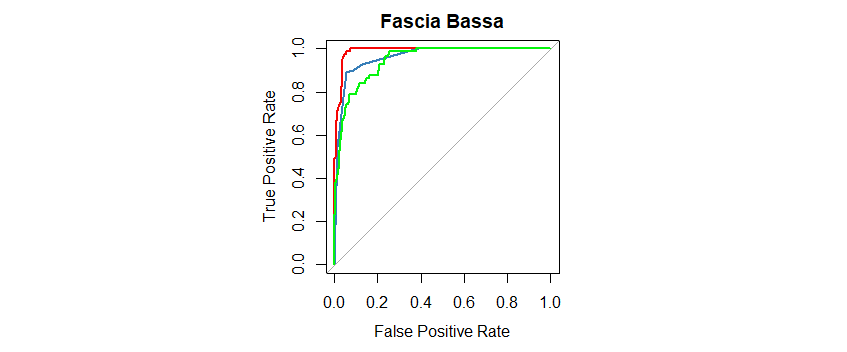
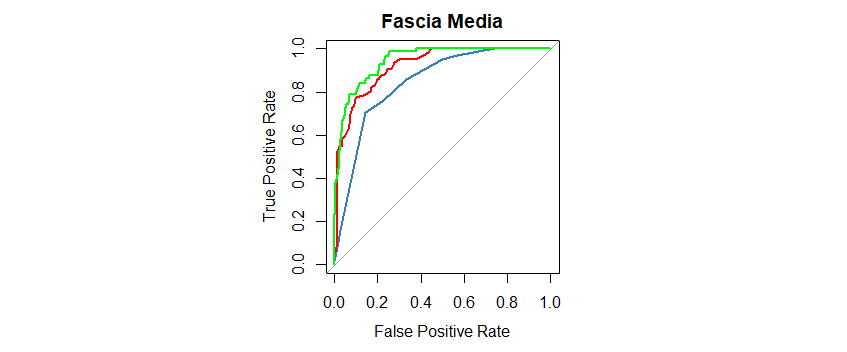

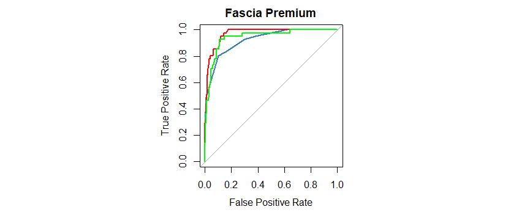

> AUC per classe target:
>
> - Fascia bassa
>   - AUC decision tree: 0.96
>   - AUC SVM: 0.95
>   - AUC random forest: 0.99
> - Fascia media:
>   - AUC decision tree: 0.85
>   - AUC SVM: 0.93
>   - AUC random forest: 0.9
> - Fascia alta:
>   - AUC decision tree: 0.85
>   - AUC SVM: 0.79
>   - AUC random forest: 0.92
> - Fascia premium:
>   - AUC decision tree: 0.92
>   - AUC SVM: 0.94
>   - AUC random forest: 0.96
>
> AUC media:
> - Decision tree: 0.88
> - SVM: 0.9
> - Random Forest: 0.94

Analizzando i grafici delle *ROC curve* e i conseguenti valori di *AUC* (area under the curve) possiamo infatti notare con che efficacia i diversi modelli sono in grado di distinguere le istanze di ciascuna classe dalle altre.

Possiamo quindi notare che il modello Random Forest risulta più performante nel riconoscere tutte le classi target ad eccezione della classe *Fascia media*, meglio riconosciuta dal modello SVM.

In conclusione possiamo quindi affermare che, in generale, il modello di classificazione Random Forest risulta essere il migliore rispetto agli altri due classificatori presentati.
